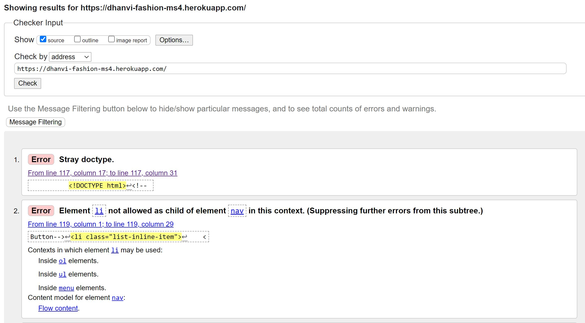
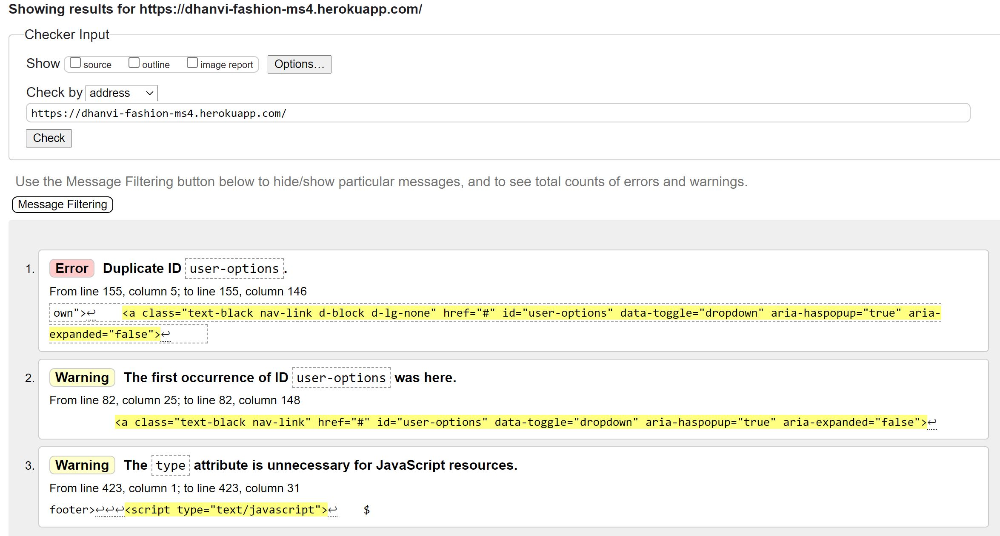
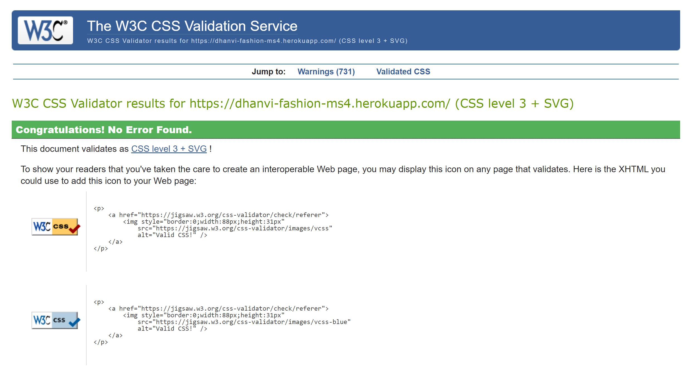
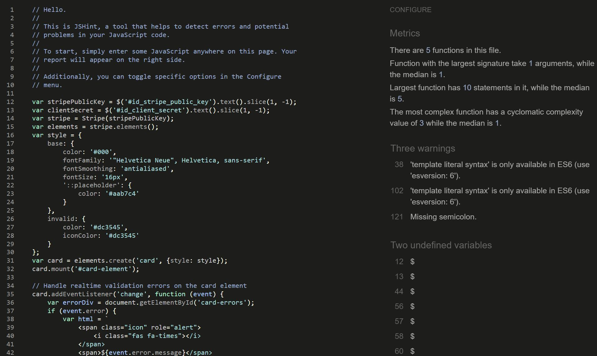
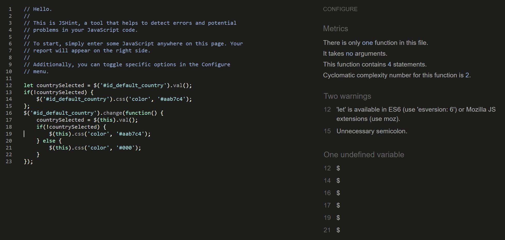
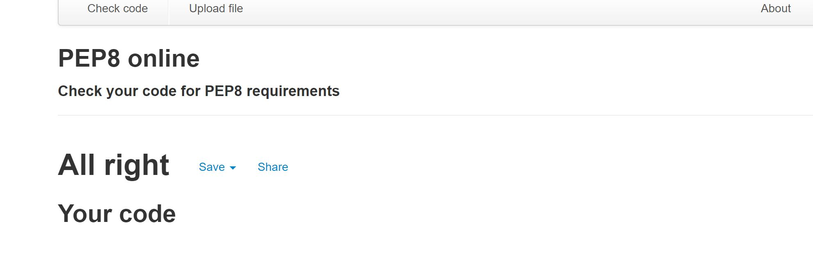
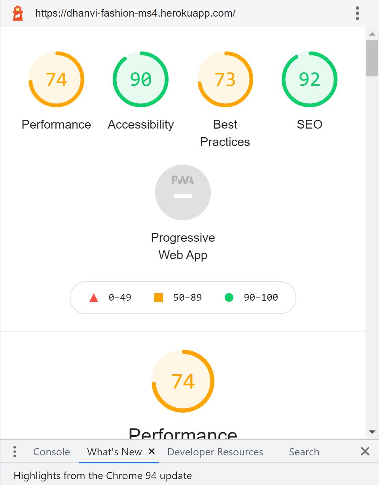

# Testing Page for Dhanvi Fashion

### An E-commerce site for online shopping.

[Main README.md file](README.md)

[View live site here](https://dhanvi-fashion-ms4.herokuapp.com/)

## Testing

* [Code Testing](#code-testing)
    * [Markup](#markup)
    * [CSS](#css)
    * [Javascript](#javascript)
    * [Python](#python)

* [User Stories Testing](#user-stories-testing)

* [Manual Testing](#manual-testing)

    * [Elements on every page](#elements-on-every-page)
       * [Navigation Bar](#navigation-bar)
       * [Footer](#footer)
       * [Toasts](#toasts)
    * [Elements on separate page](#elements-on-separate-page)
       * [Home Page](#home-page)
       * [Product Page](#product-page)
       * [Product Detail Page](#post-ad-page)
       * [Product Management Page](#product-management-page)
       * [Profile Page](#profile-page)
       * [Shopping Bag Page](#shopping-bag-page)
       * [Checkout Page](#checkout-page)
       * [Checkout Success Page](#checkout-success-page)
       * [Order History](#order-history)
       * [Blog Page](#blog-page)
       * [Blog Detail Page](#blog-detail-page)
       * [Blog Management Page](#blog-management-page)
       * [Back to Top](#back-to-top)
       * [Contact Page](#contact-page)
       * [Delete Modal](#delete-modal)

* [Responsiveness](#responsiveness)

* [Lighthouse](#lighthouse)

***

## **Code Testing**
  [W3C Markup Validation Service](https://validator.w3.org/)

### **Markup**
 [W3C Markup Validation Service](https://validator.w3.org/)

 * W3C markup validation service is used for the testing of the HTML of all HTML pages and

    The  result was this.

    
 * So, I removed the unwanted DOCTYPE from the html pages and added one ul in the mobile nav page. Then the result came like this.
    

### **CSS**
[W3C CSS Validation Service](https://jigsaw.w3.org/css-validator/)

* W3 CSS validation service is used for the testing of the **CSS** of the project and .

    The result can be seen here.

    

### **Javascript**
[JSHint](https://jshint.com/)

* JSHint, a JavaScript code quality tool was used to test the **JavaScript** codes of all 2 js pages from the project.

    The result can be seen here.
* Stripe_elements.js

*  

* Countryfield.js

* 

These warnings can be overlooked.

### **Python**
[Python Validator](http://pep8online.com/)

 The result can be seen here.

 

[Go to Top](#testing)
***

## **User Stories Testing**

Testing User stories from UX part of [README.md](README.md) 

**Viewing and Navigation** 

1. Immediately get an overview of what products this site offers.
    * This site has a main nav for the desktop which is collapsible in mobile view. This main nav has links to all the product categories. 
    * The products are sorted in many ways. For example, price, rating, and category.
    * Other than this products are displayed based on deals, new arrivals, and clearance.
    * So, it is very easy to find what products are available in the site.

2. View a list of products.
    * When the user clicks on a certain category from the main nav, the product page opens with that category. 
    * It also shows the number of products available on the left-hand side of the page.

3. View details about a specific product.
    * When a user chooses a product and clicks on the image of the product on the product page, It opens a product detail page. 
    * The product detail page has a zoom the image of the product, while click to download the image of the product, Name, description, category, and rating is also there.
    * A quantity selector box is also given so that user can select more than one product if he/she wants.
    * Size box will appear only for clothes and dresses.

4. See the total of all items in my shopping bag.
    * The Shopping bag page shows every detail related to the price of the product. 
    * It shows bag total, delivery cost (if Bag total is less than the threshold amount, in this project it is €50), and Grand Total.
    * One bag icon is given on the top right corner of the navbar, which shows the bag total, which makes it very convenient for the user to see the total irrespective of on what page he/she is.

5. See the rating of every product.
    * Rating of every product is given ate the product page, where every product is displayed. 
    * Rating is shown in number out of 5. For example 4.3/5.
    * Product rating is also given on the product detail page, where an individual product is displayed.

6. View the blog about the site.
    * This site has a very nice blog icon, which can be visit the blog page.
    * This blog section opens every blog in a detailed view when clicked. 
    * The detailed Card displays the Full blog content, as well as the name of the author and the date and time of its posting.
    * So that the user will get to know if it is a recent or old post.

7. Add comments on the blog.
    * The blog detail page has a comments section also, which displays the comments added by the user.
    * One form is given, which takes the User name, email, and comment about the blog.
    * The comments added by the user do not reflect on the page immediately. Admin has to approve it for display.
    * This feature is added for the safety from spam messages.

 **Registration and User accounts**

8. Easily register for an account.
    * Registering for the account is very easy. The register link is given in the dropdown of my account in the top navbar.
    * After clicking the register, the Register page opens, which asks the user to enter the Username, Email, and password.
    * After filling out the form the user gets an email on his/her email account to verify the email account.
    * After Verification Login page opens. And after filling that the user can log in easily.
  
9. Easily Login or Logout.
    * The login link is given at my profile dropdown in the top navbar.
    * The user is asked to enter a username and password, which he has used while registering.
    * After the correct entry, the user can easily log in.
    * If the user is not registered already then he is asked to sign up first before login.
    * When the user is logged in, the logout options display in my account dropdown. Which asks about the confirmation if the user wants to sign out.
    * When the user clicks the sign-out button, he can easily sign out from the site.

10. Easily recover my password in case I forget it.
    * A Very nice password reset feature is added from the Django allauth.
    * Which opens when the user clicks forgot password on the login page.
    * Forgot password page asks for the email address and sends a password recovery email to the user account.

11. Receive a confirmation email after registering an account.
    * When the user registers with the site, he/she gets a confirmation email in the email account provided by the user.

12. Have a personalized user profile.
    * Every registered user has a profile page.
    * The profile page can be visited from the link My profile in my account dropdown in the navbar.
    * This page has shown the default  delivery address and Order history of the user.

**Sorting and Searching** 

13. Select which category of product to show.
    * The categories of the products are displayed in the main nav and can be selected easily.
    * The category of individual products is also shown with the product name and detail.

14. Sort products by different parameters.
    * Nice sorting functionality is given on the products page.
    * Which is a dropdown and sorts the product based on Price(low to high), price(High to low), Rating(low to high), Rating(high to low), Name(A-Z), Name(Z-A),
    Category(A-Z), Category(Z-A).

15. Search for the product by name or description.
    * A search box is provided at the top bar which searches the product by name or description.
    * In mobile view only the Search symbol is visible and it shows the search box after clicking on it.

16. Easily see what I have searched for and the number of results.
    * The search function displays the products based on the search.
    * The number of products that come under that search is also shown on the top left side of the page.

**Purchasing and Checkout**

17. Easily select the number of the products when adding it to my shopping bag.
    * A quantity selector box is given on the product detail page.
    * Where quantity is increased or decreased by selecting the + or - button. The quantity can be selected by writing the number directly in the box.
    * Quantity can update in the shopping bag also by the update button provided.

18. Easily view all items in my shopping bag.
   * The shopping bag displays the list of each item in the shopping bag and its price.
   * At the bottom of the shopping bag, the Bag total of all products is shown with delivery cost and Grand total after applying the delivery cost.
   * The shopping bag displays name, description, and a small image of the product also, So there is a very little chance that the wrong product will be added by mistake.

19. Change the quantity of a product in my shopping bag.
    * In the shopping bag, one update and remove button is given below the quantity selector box.
    * The update button updates the quantity after changing it in the quantity selector box. 
    * The remove button removes the product from the shopping bag.

20. Easily enter my payment information.
    * After shopping bag, the shopper can go to the checkout page by the button provided at the bottom.
    * The checkout page takes the delivery information of the user and order summary also.
    * If the user is logged in then his/her default delivery information will be previously filled.
    * After giving card detail and clicking complete order, the shopper can checkout easily.

21. Know that my personal and payment information is secure.
    * After completing the order the page refreshes and the card number is not visible anymore. 
    * If the user leaves the site without logging out then also his/her payment detail is not visible.

22. To know if the payment is done successfully or failed.
    * After completing the order checkout success pages opens which displays the order and delivery details. 
    * The user gets one email also stating the details of the purchase. 
    * One toast message also shows the success and says that the email is sent to the user account.
    * If there is any problem with the payment then the form will display the correct information about that.

23. View an order confirmation after checkout.
    * The checkout success page displays the order detail, the user can check can confirm if there is any mistake.

24. Receive a confirmation email after ordering.
    * The user gets one confirmation email after purchasing with all the purchasing details.
    * The email will display the billing and delivery address also.

25. Have my address and billing information prefilled on the checkout page?
    * If the user is already registered and logged in then the Checkout page displays the prefilled delivery address.
    * This makes checkout easy.

**Admin and Store Management**

26. Add a product to the site.
    * A product management link is given in my account dropdown, which is visible only to the superuser.
    * The product management link opens Add product form which has boxes for product name, sku, description, price, rating, and product image or product URL.

27. Edit/ Update a product.
    * The product management page opens the edit product page when the superuser clicks the Edit button on the product page for a product.
    * The edit page is prefilled with the product detail and a very nice small image is also displayed, for better decision making.

28. Delete a product.
    * The delete link is given with every product which is visible to the superuser only.
    * The delete modal pops up after clicking the delete button for the confirmation of the action.

29. Add, Update and Delete blog posts.
    * Similar to product management, one blog management link is also given in my account dropdown.
    * This links open add blog form with the blog name, slug, author, body, and publish or draft selection.
    * The superuser can easily edit the blog by clicking the edit link on the blogs and opening the edit form.
    * The superuser can delete the blog by clicking the delete link and confirming in the delete modal.

[Go to Top](#testing)
***

## **Manual Testing**

**Manual Testing of all elements and functionality of every page.**

### **Elements on every page**
#### **Navigation Bar**

1. Click the logo and check the page stays on the Home page.
2. Type something in the search box and check if the search functionality works fine.
3. Check if the search result shows the correct product and product quantity.
4. Click on the My Account dropdown and check Register and Login links shows. 
5. Login to the site from a user account and see My profile and logout links are also visible in the dropdown.
6. Login from a superuser account and check if the product management and Blog management links are also added in my account dropdown.
7. Click on the Bag icon on the Topnav and check Shopping bag page opens.
8. In the Main nav Check, the dropdown shows all the categories in respective dropdowns.
9. Click on the category and check if it takes to the correct product category list.
10. Check the banner displays the correct amount of the discount threshold.
11. Click the Blog icon and check it opens the blog page.
12. Go to mobile view and check Search box changes to search icon and main nav changes to collapsible navbar on left.
13. Click the search icon and check the search box opens. 
14. Repeat steps 3-7 for the mobile view.
15. Click Collapsed navbar and check all category links shows.
16. Click the Home link in the collapsed navbar and check it opens the home page.

#### **Footer**

1. Check the footer is a sticky footer and always stays at the bottom.
2. Check the copyright name displays the correct name.
3. Click the social account links and check it opens the respective pages in a different window.
4. Click Contact Us link and check it opens the Contact us page.
5. Repeat steps 1-4 for mobile view.

#### **Toasts**

1. Login to the site with a correct user name and check success message appears on the right side of the page.
2. Try to Edit some products and check Alert message appears. 

### **Elements on separate pages**

### **Home Page**
#### **Carousel**

1. Check the carousel displays 3 images and sliding at a perfect time interval.
2. Check all the slides displays different cover texts.
3. Click on the buttons on the slides and check if it opens the correct related page.
4. Repeat steps 1-3 for mobile view.

#### **Blog Card**

1. Check the blog card displays a correct image on the Home page.
2. Click on the button on the card and check if it opens the Blog Page.
3. Check the blog card takes full page width in mobile view.
4. Repeat steps 1-2 for mobile view.

#### **Shop Now Card**

1. Check the Shop card displays an image of a kitchen.
2. Click on the button on the card and check if it opens the product page.
3. Check the Shop now card takes full page width in mobile view.
4. Repeat steps 1-2 for mobile view.

### **Product Page**

1. Click all product links and check the product page opens.
2. Click every category link in the main nav and check the respective product page opens.
3. Check product card  is displaying correctly with 4 cards in a row on the large screen, 3 in medium, 2 on the tablet, and 1 in mobile view.
4. Check the product image, name, price, category, and rating is displayed with every product card.
5. Click on the product image and check the product detail page opens.
6. Click on the category of the product and check that the category products page opens.
7. Login from a superuser account and check the edit and delete button works.
8. Count the products and check it is displayed in the top left with the correct number.
9. Click on the sort box in the right and check the dropdown box displays.
10. Click on each sorting and check the relevant page opens.
11. Check in mobile view and repeat steps 4-11.

### **Product Detail Page**

1. Check the image is displayed on the left and details on the right side.
2. Click on the image to download the product image.
3. Check the product image zoomed while mouse pointer move.
4. Check the Name, Price, and rating are displayed correctly on the product detail page.
5. Click on the category icon and check it opens the particular category page.
6. Check the product description for any spelling errors.
7. Check the quantity selector that the default value is 1 selected. 
8. Click + button on it and check the quantity increases and does not go beyond 99. 
9. Click - button and check quantity decreases and does not go below 1.
10. Click in the box and add the number and check it takes numbers between 1-99.
11. Click the keep shopping button and check it opens the product page.
12. Click the add to bag button and check it opens a success alert with Go to secure checkout link.
13. Check in mobile view the image takes full-page size and detail and description comes under that.
14. Repeat steps 2-11 in mobile view.

### **Product Management Page**

1. Open the product management page by login from the superuser account and clicking product management from   the dropdown in my account in the navbar.
2. Check that Add a product page opens.
3. Click on the category dropdown and check it shows all the categories used for this project.
4. Click in the sku box and check it allows you to enter any number.
5. Enter some data in name, description, price, and rating and click add product at the bottom. check it allows to add the product with a success toast message.
6. Select some images and check it displays the image selected name beside the button.
7. Click the cancel button and check it opens the product page. 
8. Click the add product button and check a product is added and the product detail page opens.
9. Go to mobile view and repeat steps 1-8.

### **Profile Page**

1. Login to the site and click the My Profile link in my account dropdown, check my profile page opens.
2. Check the default delivery page is already filled with the phone number, address, country with the already entered user details. 
3. change some information and click the Update information button at the bottom, check the profile gets updated with a success message.
4. Check the order history on the right side.
5. Check it displays Order number, Date, Items, and Order total of the purchase done in past.
6. Click on the Order number and check it opens the order history page with thank you message and one alert message that it is a past confirmation.
7. Go to the mobile view and repeat steps 1-6.

### **Shopping Bag Page**

1. Go to the shopping bag page by clicking the bag icon on the top right in the navbar.
2. Check the Shopping bag page displays product image, name, and sku, price, quantity selector box, Subtotal.
3. Check the quantity selector box by increasing the quantity and selecting the update button below that.
4. Click the remove link below the quantity selector box and check the product is removed from the shopping bag.
5. Check the Bag total is showing the correct amount in the bag.
6. Check the delivery amount, It should be 10% of the bag total and If the bag total is more than $50 then it should be 0.
7. Check the display message after Grand total stating how much more to spend to get $50 in bag total.
8. Check the Grand Total, It should be the addition of Bag total and delivery.
9. Click the Keep Shopping button and check it takes to the product page. 
10. Click the Secure Checkout and check it opens The checkout page.
11. Go to mobile view and repeat steps 1-10.

### **Checkout Page**

1. Go to the checkout page by clicking Secure Checkout on the shopping bag page.
2. Check a Form opens with a detail box of Full Name and email address. 
3. Check the delivery section has boxes for the phone number, street address1, street address2, Town or city, County state or locality, Postal Code, and Country dropdown.
4. Enter some details and Enter the card number in the payment section of the form.
5. The test card number given by stripe is 4242 4242 4242 4242, the expiry date is 04/24, CVC is 242 and ZIP is 42424.
6. Check the small red message at the bottom stating how much will be charged from the card.
7. Click the Adjust bag button and it should open the shopping bag page.
8. Click the Complete Order button after filling out some test details and the checkout success page should open after a full-page spinner and Success confirmation.
9. Enter some different card detail and check the message in red that the card number is invalid.
10. Check the order summary displayed on the right that shows the correct number of products in the Bag.
11. Check it shows the correct product image, name, subtotal of the product. Order total, delivery, and Grand Total of the Shopping bag.
12. Go to mobile view and repeat steps 1-10.

### **Checkout Success Page**

1. Go to the Checkout success page by clicking the Complete Order button on the checkout page.
2. Check the message on the top with the user's email id.
3. Check the order info, Order detail, Delivering To address, and Billing info.
4. Click the Now Checkout The latest deals button and check the Special offer category page opens.
5. Go to mobile view and repeat steps 1-4.

### **Order History**

1. Go to the order history page by clicking the individual order number on the My Profile page. 
2. Check it shows correct information about the user's profile.
3. Click the Back to Profile button at the bottom and check it takes to MY profile page.
4. Repeat steps 1-3 for mobile view.

### **Blog Page**

1. Go to the Blog page by clicking Blog card on the home page or blog icon in the top nav.
2. Check the blogs are displayed in row with blog image in left and Blog name, Author name, Date and time of posting is there in right side.
3. Click the blog image and check the individual blog detail page opens.
4. Click on Blog Title and check the Blog detail page opens.
5. Click on the Read More button on the blog card and check the new blog detail page opens.
6. Login from the superuser account and check Edit and delete buttons are visible.
7. Click the edit button and see the blog management page should open.
8. Click the delete button and the delete modal should pop up.
9. Repeat steps 3-8 in mobile view.

### **Blog Detail Page**

1. Click the Blog image or Title or Read More button on the Blog page and reach the Blog detail page.
2. Check the blog image takes full-page and check any spelling error in Blog Body.
3. Login from a superuser account and check the edit and delete buttons are visible and working accordingly.
4. Click the Back to Blogs and Check that it takes to the Main Blog page.
5. Check the comments section that displays the comments with the name of the user who posted it and the date and time of its posting.
6. Check the comment form by typing Name, Email, and some comments and click Submit.
7. Check the message "Your comment is awaiting moderation" displays and the comment form disappears.
8. Go to the comments section through Django admin and approve or delete that comment.
9. Repeat these steps for mobile view.

### **Blog Management Page**

1. Go to the Blog management page from the dropdown in My account in Navbar.
2. Check the Add a blog form opens with a section of Title, Slug, Author, and Body. One box is there to add an Image URL or select an image button to add an image.
3. Check the status is Draft or Publish. 
4. Fill the form with some information and press cancel the Blog page will open.
5. Fill the form and press Add Blog, A new blog will be added with a success message.
6. Repeat these steps in Mobile view.
7. Click the edit link in the blog and check the Edit a blog page opens with the form section already filled with the selected blog details.
8. Make some changes and click Edit the blog, Blog should be edited with a success message and blog detail should open.
9. Repeat these steps for mobile view.

### **Back to Top**

1. Go to the product and shopping bag page and check Back to top button is there.
2. Go down on the page and click on the button, The page should go on top.
3. Repeat in Mobile view.

### **Contact Page**

1. Open the contact form from the link in the Footer "Contact Us".
2. Check the form displays the full name, Email address, Subject and Message section, and a Send Message button.
3. Fill the form with some incorrect email format and the form validation should work.
4. Click send message and a success message should show "Thank you for contacting Dhanvi Fashion. we will respond to you as soon as possible."
5. Repeat these steps in mobile view.

### **Delete Modal**

1. Check the delete modal by clicking the delete link on the product or blog.
2. The delete Modal should pop up with a message asking for confirmation for that particular product or blog.
3. Click cancel and go back to the previous page.
4. Click delete and the product or blog gets deleted with a success message.
5. Repeat these steps in mobile view.

[Go to Top](#testing)
***

## **Responsiveness**

* DevTools- Devices tested across a range of widths: iPhone5(320px)| Samsung S5(360px)| iPhone6/7/8/X(375px)| iPhone6/7/8 Plus(414px)| iPad(768px)| iPad Pro(1020px)| Laptop(1200px)| Large Desktop Screen(1920px)
 * Viewed site on above range on various browsers: Google Chrome, Firefox, Opera, Safari.
 * Viewed on physical devices: small phone(320px)| Large phone(414px)| large tablet(768px)| medium, laptop(1366px)| Large Desktop Screen(1920px)

[Go to Top](#testing)
***

## **Lighthouse**

Lighthouse testing was done in Chrome Devtools and the result found was this.

[Go to Top](#testing)
***

